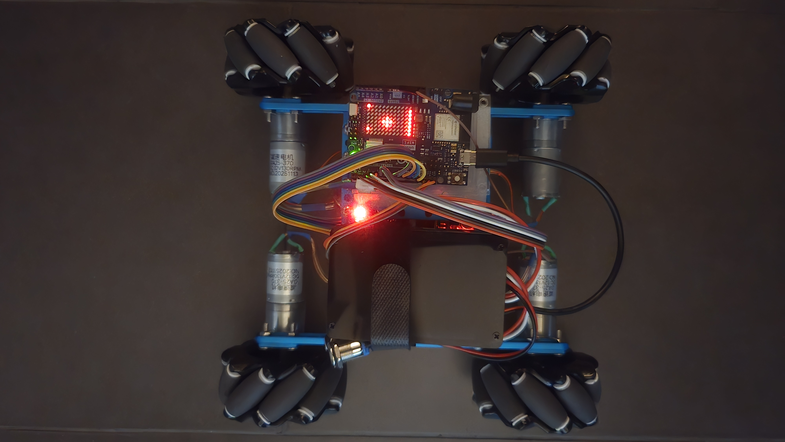
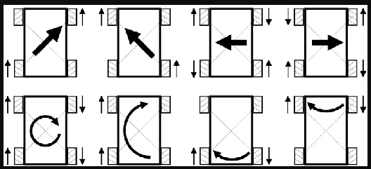
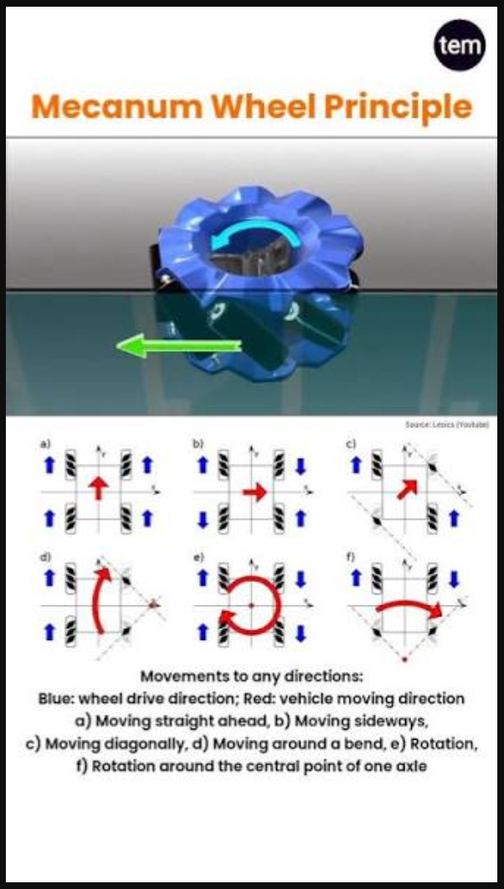

# r4_mecanum_base — Nesso-driven mecanum rover on an Arduino Uno R4 WiFi



A 4-wheel **mecanum** rover on an Arduino Uno R4 WiFi, driven from an Arduino Nesso N1
handheld running [Nesso_base](https://github.com/ugursayar/Nesso_base) over
[NessoLink](https://github.com/ugursayar/NessoLink) `RemoteFrame`s. The sketch accepts
**both Wi-Fi (UDP + TCP) and Bluetooth LE** and auto-pairs with whichever remote speaks
first — no companion Linux MPU, the R4 owns the radio and the drive loop.

The drive logic was first developed on an **Arduino Uno Q** version of the same chassis
(not published); this repo is the port to a bare R4, and the docs keep the comparison where
it explains a decision.

> **Calibrated and verified on hardware 2026-08-06.** `MOTORS[]` order, the `inv` flags and
> `VX_SIGN` are all **measured** — see **Bring-up** (`VX_SIGN` re-measured **2026-08-11**
> after the wheels were remounted in their correct corners). Confirmed on the rover with a
> real
> Nesso N1: pairing and sustained link over **both BLE and Wi-Fi UDP**, **switching between
> the two transports live** with no power cycle, all four motors, forward / reverse / rotate
> / strafe, mode changes, the LED matrix indicators, and the battery gauge on pack power.
>
> `[batt] no sensor` on a USB-powered run is **expected, not a fault**: the UPS is switched
> off while USB is connected, so the INA219 is unpowered. It is re-probed every 5 s and
> joins on its own once the pack is on.
>
> **TCP is disabled** (`ENABLE_TCP 0`) — see **Transports** for the measured reason.

Engineering notes and traps are in [CLAUDE.md](CLAUDE.md).

```
 Nesso N1  ──[ BLE | Wi-Fi UDP:8889 | Wi-Fi TCP:8890 ]──▶  Uno R4 WiFi  ──▶  2x L298N ──▶ 4 mecanum wheels
                                                                          └─▶  12x8 LED matrix + Serial
```

## What carried over from the Uno Q build, and what didn't

Everything that is *drive logic* came across with its behaviour intact:

- the axis dead-zone / stall-compensation split placed on **opposite sides** of the
  mecanum mix (snapping to `MIN_PWM` before mixing leaks a phantom strafe into a pure
  forward command),
- the per-wheel mecanum mixer and the proportional down-scale on overflow (clamping
  wheels independently distorts the commanded direction),
- the slew limiter, the `REMOTE_DEADBAND = 25` that fixed the earlier build's "sometimes it
  won't stop" bug, and the stale-link stop,
- the click / long-press mode gestures, the **throttle lock**, the **secondary stick**
  and `MODE_WHEELTEST`.

What changed, and why:

| | Uno Q build | here (Uno R4 WiFi) |
|---|---|---|
| **Transport** | Router Bridge from a Linux MPU that owned the radio | the sketch owns the link: Wi-Fi UDP/TCP + BLE, alternating search, sticky pairing |
| **Vision / `MODE_AUTO`** | camera object-chase on the MPU, gated by a host ARM toggle | **removed** — no camera, no host |
| **Double-click gesture** | selects `MODE_AUTO` | **removed** with it, and with it the 500 ms lag every mode change paid waiting to see if a partner click was coming |
| **Battery (INA219)** | polled and displayed, indicator-only | **ported**, on A4/A5 instead of D20/D21; still indicator-only |
| **Matrix** | 13x8 read in portrait, logical 8x13 frame | 12x8 read in portrait, logical 8x12 frame — same 90 deg CW `px()` mapping |
| **Loop timing** | `delay(60)` — frames arrived on a separate Bridge thread | 60 ms *tick*, no blocking delay: the radio is polled every pass or datagrams drop |

## Full holonomy from a two-stick N1

Mecanum is 3-DOF (forward, strafe, rotate) but the N1's drive stick has two axes, which
it pre-mixes into tank `leftMotor`/`rightMotor` — so a one-stick remote cannot reach all
three at once, which is the only reason modes exist. When the N1 reports a **second
stick** (frame flag `hasAux`) the mapping is **fixed** and modes stop mattering:

| stick | axes |
|---|---|
| primary (seesaw) | throttle + rotate → `vy`, `w` |
| secondary (aux 1) | throttle + strafe → `vy`, `vx` |

All three DOFs are live at once, so every motion in the reference chart below —
diagonals, strafe, and all four rotation types including the axle pivots — is available
**by default**, no mode change needed. Modes are one-stick machinery: with two sticks
there is nothing left to select, so the click cycle is disabled and the mode pins to
`DRIVE` (the click still clears the throttle lock, and still exits `WHEELTEST`).
`NESSO_BTN_STICK2` is deliberately unbound. The two sticks' contributions **sum then
clamp**, so the shared throttle axis adds where they agree and cancels where they fight.
A one-stick remote is unaffected — `hasAux` is honoured rather than inferred from a
non-zero reading, since the encoder zeroes the aux fields and `0/0` cannot distinguish
"no stick" from "stick centred". (The N1 can carry a **third** stick — NessoLink v2's
`aux2X`/`aux2Y`/`hasAux2` — which is decoded by the library but deliberately unbound
here for now.)

> Until 2026-08-11 the aux stick instead drove whichever mode was *not* selected. The
> same motions were reachable, but the sticks swapped roles when the mode changed, which
> bought nothing over a fixed mapping and made what a stick does depend on a dot on the
> matrix.

**Axis convention is the protocol's, not a local guess.** NessoLink **1.1.2** states it
normatively: every axis is −255..255, `auxX` is screen-horizontal with **+ = right**,
`auxY` screen-vertical with **+ = up**, and a released stick reads exactly 0. The
transmitter has already normalised for its display orientation and module mounting, so
this end reads right/up and does nothing else — no sign flip, no swap, no rescale, and
deliberately **no `AUX_X_SIGN`/`AUX_Y_SIGN` knob**. If an axis is wrong, fix the
transmitter: a receiver cannot know how a handheld's modules are mounted, so compensating
here would leave every other NessoLink receiver still wrong and would invert this one the
moment the transmitter was fixed. (That contract exists because the Uno Q build guessed first
and got both the transposition and the ±515 scale wrong.)

Note the N1 **may already be setting `hasAux`** if a Mini JoyC is fitted — v1 frames have
always had an aux slot — so this can change how an existing handheld drives.

## Throttle lock

A long press sets the **throttle lock**: the forward/back axis is forced to zero, leaving
the mode's other axis live. It is orthogonal to the mode rather than being one — hold in
`DRIVE` and you can only rotate (this *is* the Uno Q build's old `MODE_ROTATE`, bit for bit);
hold in `STRAFE` and you can only slide sideways, which had no way to be expressed before.

The lock applies to the **sum of both sticks**, after they are gathered, so "locked" means
no forward motion can be commanded from anywhere — a second stick that could still drive
forward would make it mean "locked, unless you use the other stick", which is not a lock.
It does not survive a mode change, and a click always clears it in one step.

## Mecanum motion reference — including the four rotations





The charts above are the standard reference; the roller hatching shows the mounting the
mix assumes — **viewed from above, the top rollers form an X pointing at the chassis
centre** (see `VX_SIGN` in the sketch). Every motion shown falls out of the same four
mix lines with no special cases, including the diagonals (they appear whenever
`vy = ±vx`, one wheel pair cancelling to zero on its own).

Note the bottom row: there are **four distinct rotation types**, not one, and they differ
in what they need from the operator:

| rotation | axes | how to command it |
|---|---|---|
| spin in place | `w` alone | primary stick sideways |
| around a bend (arc) | `vy + w` | primary stick diagonal |
| pivot on the **rear** axle midpoint | `vx = +w`, `vy = 0` | needs strafe **and** rotate at once — two sticks |
| pivot on the **front** axle midpoint | `vx = −w`, `vy = 0` | needs strafe **and** rotate at once — two sticks |

The axle pivots work because blending equal strafe and rotate cancels one wheel pair
exactly: with `vx = +w` the rear pair's `−sx + w` / `+sx − w` terms zero out, so only the
front wheels drive (opposed) and the rover pivots about the stationary rear axle; `vx = −w`
is the mirror case. A one-stick remote can never reach them — no single mode carries both
`vx` and `w` — which is a concrete payoff of the two-stick holonomy above: primary stick
sideways (rotate) plus aux stick sideways (strafe) in the matching direction pivots the
rover on an axle instead of its centre; opposite directions pivot on the other axle.

## Wiring

Two L298N modules, one per axle, so the high-current leads stay short.

| wheel | module, channel | IN a | IN b | EN (PWM) |
|---|---|---|---|---|
| front-left  | #2 (front), **B** | D12 | D13 | **~D10** |
| rear-left   | #1 (rear), **A**  | D2  | D3  | **~D5**  |
| front-right | #2 (front), **A** | D8  | D11 | **~D9**  |
| rear-right  | #1 (rear), **B**  | D4  | D7  | **~D6**  |

**This is byte-for-byte the Uno Q build's pin map**, deliberately: the same chassis and motor
harness move between the Uno Q and the R4 with nothing re-terminated, and the two sketches'
`MOTORS[]` tables read against each other line for line.

The two modules have **opposite channel conventions** — the rear is `A = left, B = right`
but the front is `A = right, B = left`. That is why the front pair looks transposed against
the rear in `MOTORS[]`; it is the wiring, not a slip.

> **One R4-specific difference: `D13` *is* the built-in LED here** (`PIN_LED = 13`, port
> P102), whereas on the Uno Q it is not. D13 is front-left's second direction pin, so the
> onboard LED mirrors that motor's direction bit — cosmetic (the L298N input is
> high-impedance), but don't read that LED as a status light. The variant drives it LOW in
> `initVariant()` before `setup()`, so it boots to a defined state.

`analogWrite()` is only real PWM on **D3 D5 D6 D9 D10 D11** (confirmed in the `UNOWIFIR4`
variant's `initVariant()`) — on any other pin the core silently degrades it to a 0/1 digital
write, so the four EN pins must come from that set. All four above qualify. D0/D1 (Serial1)
and **A4/A5** are untouched; A4/A5 carry the UPS_3S INA219 at 0x41. D10–D13 are the SPI bus
and are used as plain GPIO here, which costs nothing since nothing on this board needs SPI.

## Bring-up — in this order

Steps 1 and 2 are **done and measured** (2026-08-06); step 3 is still open. The order below
cannot be shortcut, and is kept because it is how the current values were derived.

1. ✅ **Wheel identification.** `#define START_IN_WHEELTEST 1`, reflash. Each wheel spins
   for 1.4 s in turn with a 0.6 s still gap, while the matrix lights the quadrant the code
   *believes* that wheel sits in. If the lit corner and the spinning wheel disagree,
   **reorder `MOTORS[]`** — never compensate in the mix.
   *Result: every slot drove the corner the matrix lit, so `MOTORS[]` order is confirmed.*

   This is the only test that catches a front/rear swap within one side: driving forward is
   invariant to any permutation of the four wheels, and rotating only distinguishes left
   from right, so such a swap passes both of those tests and corrupts nothing but strafe.

2. ✅ **Direction.** With the wheel test still running, flip `inv` on every wheel that turns
   backwards. *Result: only front-right needed flipping, giving `{true, true, false,
   false}` — the whole left side inverted and the whole right side not, which is what a
   chassis with mirror-mounted sides gives when every motor is conventionally terminated.
   The symmetry is itself evidence the result is right.* Four wheels turning the same
   **absolute** direction is the wrong state — it drives one side backwards.

3. ✅ **Strafe.** Only now check it. *Result (re-measured 2026-08-11): `VX_SIGN` is
   **`+1`**. It was first measured at `-1` on 2026-08-06, but that run had the mecanum
   wheels mounted in the wrong corners — remounting them correctly inverted the strafe and
   nothing else, so the sign flipped with them. With the wheels right, this chassis is the
   standard X roller layout.* Flip that **one constant**, never `inv`, which is by now
   calibrated for forward motion and would break straight tracking. Remounting wheels
   between corners changes only this constant — `MOTORS[]` and `inv` describe the motors
   and wiring, which don't move with the wheels.

   The order is what makes this attributable: by step 3 the corner mapping was confirmed
   and forward already tracked straight, so no wiring fault could still be in play — only
   the diagonal the rollers push along was left. Rotation needing no flip is the other half
   of the proof, since a wiring fault would have shown up there too.

## Controls

| gesture on the stick button | effect |
|---|---|
| single click | clear the throttle lock if set — that is *all* it does; otherwise cycle `DRIVE` ↔ `STRAFE` (one-stick handhelds only — with two sticks there is nothing to cycle), or from an off-cycle mode back to `DRIVE` |
| long press (800 ms) | set the **throttle lock** on the current mode (idempotent, not a toggle) |
| reflash only | `MODE_WHEELTEST` |

One click is always exactly one step back toward plain `DRIVE`. `MODE_WHEELTEST` gets no
gesture on purpose: it ignores both sticks and spins wheels on a timer, so landing on it
mid-drive means the rover moves off with the sticks centred.

Matrix cues: sweeping bar = searching (top-left block = Wi-Fi phase, top-right = BLE);
plus-shaped dot = the virtual stick, with `col 0` lit for a Wi-Fi link / `col 1` for BLE
and 1–3 mode dots on the right edge; full **X** = paired but no signal; 3x3 block =
wheel test; blinking battery outline = critically low pack. **A locked throttle drops the dot's vertical arms and leaves a horizontal
bar** — the indicator describes itself, the arms it drops being the axis it gave up, and
it cannot be confused with "throttle merely centred" (a plus on the centre row).

## Failsafe

No valid frame for `FAILSAFE_MS` (700 ms) → all axes zero and the slew limiter ramps the
rover to a stop. Lost for `UNPAIR_MS` (3 s) → un-pair and search again. Every transport
transition cuts the motors *first*, skipping the ramp: swapping radios blocks for up to
nine seconds and nothing services the drive tick while it does.

## Configure

| constant | default | notes |
|---|---|---|
| `ENABLE_BLE` | `1` | `0` = Wi-Fi only, no ArduinoBLE dependency or modem-firmware update |
| `ENABLE_TCP` | `0` | leave off — `WiFiServer::available()` blocks ~10 s per poll, see **Transports** |
| `SEARCH_FAIR_AFTER` | `2` | fruitless windows after which the sticky preference stops applying |
| `SECRET_SSID` / `SECRET_PASS` | `arduino_secrets.h` | must be the N1's 2.4 GHz network |
| `UDP_PORT` / `TCP_PORT` | `8889` / `8890` | must match the N1 firmware's `udp_port` / `tcp_port` |
| `SEARCH_PREFER_BLE` | `0` | cold-boot search preference; thereafter sticky |
| `SEARCH_LONG_MS` / `SEARCH_SHORT_MS` | `15000` / `4000` | dwell on the preferred transport / brief probe of the other |
| `MIN_PWM` / `MAX_PWM` | `60` / `255` | stall floor / ceiling — both validated on the rover, see **Power and PWM** |
| `REMOTE_DEADBAND` | `25` | applies to both sticks. Belt-and-braces since NessoLink 1.1.2 made "a released stick reads exactly 0" part of the contract; kept as the only cover against an out-of-date transmitter. A non-zero rest reading now means a stale handheld build, not jitter |
| `SLEW_STEP` | `40` | max PWM change per 60 ms tick |
| `VX_SIGN` / `MOTORS[].inv` | — | calibrate on the bench, see **Bring-up** |

The R4's ESP32-S3 shares one antenna between Wi-Fi and BLE and **cannot run both at
once**, so the search alternates. The preference is sticky — it follows whichever
transport last paired — because the R4's BLE-central connect momentarily disrupts the
N1's own Wi-Fi (the N1's C6 also shares one radio). If you only ever use one transport,
set `SEARCH_PREFER_BLE` accordingly, or `ENABLE_BLE 0` for Wi-Fi-only.

## Build & flash

```powershell
# NessoLink installed via Library Manager (or arduino-cli lib install NessoLink)
arduino-cli compile --fqbn "arduino:renesas_uno:unor4wifi" --build-path build .

arduino-cli upload  --fqbn "arduino:renesas_uno:unor4wifi" --port COM5 --build-path build .
```

Footprint: **39% flash / 35% RAM** with BLE, **27% / 29%** Wi-Fi-only.

Requires **NessoLink ≥ 1.1.2** (codec only — its Wi-Fi transport classes are ESP32-only,
so this sketch decodes packets off the Renesas MCU's own stack) and, for BLE,
`ArduinoBLE` plus an up-to-date ESP32-S3 modem firmware on the R4. 1.1.2 matters for the
aux axis contract above; the wire format is unchanged from 1.1.1.

## LED matrix layout

The panel is physically 12x8, but the board is read **turned**: every draw routine works in
a **logical 8 wide x 12 tall portrait frame** and `px()` applies a **90° CW** rotation on
the way out. Logical (0,0) is the viewer's top-left, +x right, +y down.

```
   x 0 1 2 3 4 5 6 7
 y 0 L b . . . m m m     row 0  — STATUS: link (x0 = Wi-Fi, x1 = BLE), mode dots from the right
   1 . . . . . . . .              (1 = DRIVE, 2 = STRAFE, 3 = WHEELTEST)
   2 . . . # . . . .
   3 . . # # # . . .     rows 2..9 — the stick dot. Up = forward, right = right.
   4 . . . # . . . .              Locked throttle drops the vertical arms -> a bare bar.
   .
   9 . . . . . . . .
  10 . . . . . . . .
  11 # # # # # . . w     row 11 — BATTERY gauge (1..8 px), low-battery blink at x7
```

`MATRIX_ROTATE_CW` is the single constant encoding how the board is mounted. **If the whole
display comes out inverted, flip that** — never an individual draw routine, since they are
all correct relative to one another in logical coordinates.

An **empty bottom row means "no INA219"**, never "flat pack": the gauge always lights at
least one pixel while the sensor answers. Those are opposite states — a missing sensor
deliberately disables battery management and leaves the rover driving — so they must not
look alike.

## Battery — UPS_3S pack monitor (indicator only)

An INA219 at **0x41 on A4/A5** watches a 3S 18650 pack. The module is **re-probed every
5 s while absent**, so it can be powered up after the sketch has started — or be off
entirely, as it is on a USB-powered bench run — and will come online by itself, logging
`[batt] INA219 @ 0x41 online`. An empty gauge row on USB is therefore normal. Thresholds are on the *pack*
voltage (bus + shunt drop) smoothed by an EMA with tau ≈ 20 s, because the motors draw from
the same pack and a stall sags the rail well below the true state of charge — so a brief sag
can never trip the display while a real decline still shows within ~30 s.

| | | |
|---|---|---|
| `V_MAX` / `V_MIN` | 12.6 V / 9.0 V | 4.2 / 3.0 V per cell = 100% / 0% |
| `V_WARN` | 9.6 V (~17%) | advisory: blinking pixel at the end of the gauge row |
| `V_CRIT` | 9.3 V (~8%) | latched: full-panel blinking battery outline |
| `V_RELEASE` | 10.5 V | the critical latch clears only once clearly recharged |

**It takes no action.** It never cuts the motors and never shuts anything down, so the
pack's own BMS is the only automatic protection — a flat pack under load will be dragged to
BMS cutoff if the operator ignores the panel. This matches the Uno Q build, which deliberately
made the pack indicator-only.

Its failsafe points the **opposite way to the link's**, on purpose: an absent or failed
INA219 reports "no sensor" and leaves the rover driving, because losing a *sensor* must not
immobilise it — whereas losing contact with the *operator* must never leave it driving.

## Power and PWM — is full stick really full power?

Yes. `MAX_PWM = 255` reaches a genuine **100% duty cycle**, not 254/255. Traced through the
R4 core rather than assumed:

```c
analogWrite(pin, 255)
  → pulse_perc(255 * 100.0 / ((1 << 8) - 1))   // _writeResolution = 8  → 100.0 %
  → pulse = period * 100/100 = period
  → set_duty_cycle(period)                      // compare == period → no low phase
```

So at full stick the EN pin sits **continuously HIGH at 5 V** (the R4 is a 5 V logic board).
PWM frequency is **490 Hz** (`STANDARD_PWM_FREQ_HZ` in the core's `FspTimer.h`) — the same
as a classic Uno, and comfortably fine for an L298N.

**That 5 V is not what drives the motors.** EN is a logic enable into the L298N; motor
current comes from the module's `Vs` rail — the 12.6 V pack — never from the Arduino's 5 V.
Full throttle means the H-bridge is on 100% of the time, so each motor sees roughly

```
12.6 V (pack, sagging under load)  −  ~2 V (L298N drop)  ≈  10.5 V
```

That drop is the classic L298N's known weakness: it is a BJT H-bridge, two saturated
transistors in series per path, so the loss is largely load-independent, worsens with
current, and leaves as heat. Firmware cannot recover it.

**`MAX_PWM` therefore has no headroom left.** If the rover ever needs more, the remaining
levers are hardware — a higher pack voltage, or a MOSFET driver (TB6612FNG, DRV8871,
BTS7960) in place of the L298N, which would give back most of that 2 V.

`MIN_PWM = 60` is the stall floor and was **validated on the rover under real load**: it
moves easily on minimal commands, so the floor is high enough to break stiction without
being so high that fine control near centre goes coarse.

## Transports — why TCP is off

`ENABLE_TCP` defaults to **0** and should stay there unless something genuinely needs TCP.

WiFiS3's `WiFiServer::available()` is not a cheap poll. It is a **synchronous modem
round-trip** that performs the `accept` on the ESP32-S3:

```cpp
modem.write(string(PROMPT(_SERVERAVAILABLE)), res, ...);   // blocks until the modem answers
```

With no client pending it waits out the modem's timeout — **measured at ~10.1 s on this
board, on every loop pass**. That is 14x `FAILSAFE_MS`, so the symptom is not "TCP is slow"
but "the rover is unusable over Wi-Fi": the drive loop stops, the link goes stale, the rover
stops, it unpairs, re-pairs on the next buffered datagram, and does it again 10 s later.

The N1's Wi-Fi mode is UDP, so nothing is lost. The stream re-assembler (`TcpParser`) is
kept and still correct — it is the *polling* that is unaffordable. If TCP is ever needed it
must run on a slow timer or off the drive loop entirely, never once per pass.

### Switching the handheld between BLE and Wi-Fi

**Verified on the real N1 2026-08-06: switching either direction re-pairs on its own, with
no power cycle.** Two bugs used to make it require one, both fixed:

- **The listener was bound once, inside a blocking window.** If the Wi-Fi association had
  not completed within `enterWifi()`'s 9 s wait, the sockets were never opened *at all*, and
  a window that associated a moment later sat fully connected and deaf for its whole dwell.
  Nothing retried it. `ensureWifiListening()` is now idempotent and runs from the poll loop,
  so a late association is picked up within milliseconds. "Associated" and "listening" are
  different states.
- **The sticky preference never decayed.** After pairing over BLE it gave BLE 15 s windows
  and Wi-Fi only 4 s — and that 4 s had to cover a possibly-slow reconnect *before* any
  listening began. The preference votes for whatever worked **last** time, but the usual
  reason a link stops is that the operator moved the handheld to the **other** transport.
  It now stops applying after `SEARCH_FAIR_AFTER` fruitless windows and both transports get
  the full dwell. (This is also why a power cycle "fixed" it: reset cleared `preferBle`.)

### The stall detector

Any loop pass slower than `STALL_WARN_MS` (300 ms) logs `[stall] loop blocked N ms`.
Anything over `FAILSAFE_MS` drops the link, so this makes such a fault self-reporting rather
than something to infer from mysterious unpairs — it is what found the TCP problem in one
run. Transport hand-offs legitimately block for seconds and stop the motors first, so
`gotoState()` clears the reference and they are not reported.
